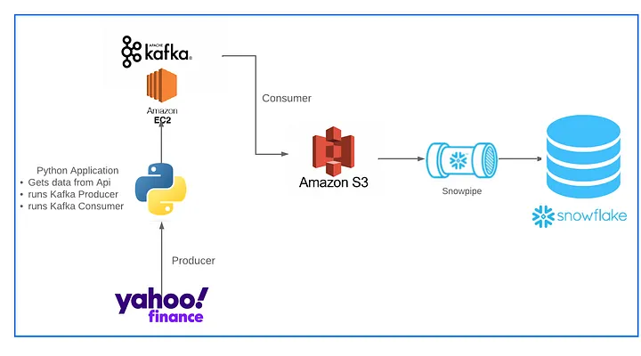
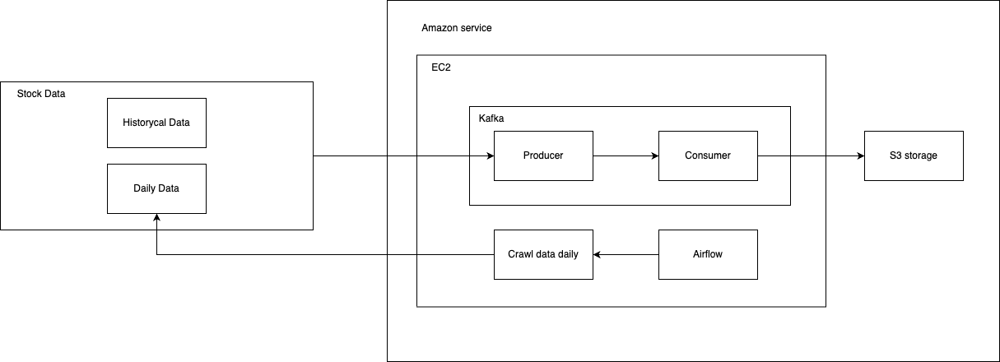

# Stock Market ETL using Apache Kafka and Snowflake

``Perform an ETL for stock market data``

## I. Dataset
- The data source that is **Yahoo finance**. Yahoo finance provides us with a free python library **yfinance** which can be used to get the finance data.
- The data that receive from **yfinance** is **like a real time data** then use of **Apache Kafka** for **data streaming**

## II. Tools
- Python
- Kafka
- Airflow
- EC2 service
- S3 service
- Snowflake

## III. Architecture
- end-to-end architecture:

- kafka architecture for storage data:

## IV. Flow

1. **Airflow** settings for run **python** pull data daily from **API** that run on **EC2 service**
2. Then data will be pushed by **kafka producer**
3. **Kafka consumer** will read data from message queue and store it in **S3 service**
4. **Snowflake** setup for **auto-ingestion** data from S3 when any data pushed to S3. Then we can query and process data on Snowflake.

## V. Setup
1. Run file **setting_up_kafka.py** for creating topic, producer and consumer for kafka. And it will get the list stock code and history data the push to kafka. 
2. Run airflow with **stock_dags.py** for run daily.
3. Setup snowflake with some query config in file **snowflake.txt** for auto-ingestion data from S3
- [ guides automating snowpipe for S3 service](https://docs.snowflake.com/en/user-guide/data-load-snowpipe-auto-s3)

> **_Note_**: After create auto-ingestion on snowflake. In S3 bucket, Create an event notification (in tab properties -> Event notifications). And follow below steps:
> - Events: Select the ObjectCreate (All) option.
> - Send to: Select SQS Queue from the dropdown list.
> - SQS: Select Add SQS queue ARN from the dropdown list.
> - SQS queue ARN: Paste the SQS queue name from the SHOW PIPES output.
